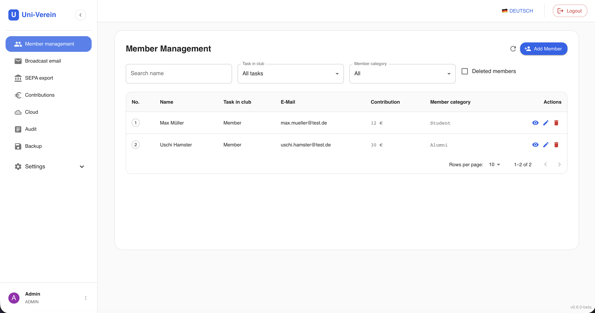

# Uni-verein

### Open Source club management software for university associations

## 📖 About

**Uni-verein** is a free and open source club management software specifically designed for university associations and student clubs. Whether you run a sports club, a cultural association, or any other student organization — uni-verein helps you manage your members, mails and finances all in one place.

---

## ✨ Features

- 👥 **Member Management** — Add, edit, and organize members
- 💰 **Finance Tracking** — Keep track of membership fees, income, and expenses
- 📄 **Document Storage** — Store and share important club documents and files
- 📧 **Email Notifications** — Send mails for events or announcements
- 🔐 **Role-Based Access Control** — Assign different roles (Admin, User, Finance)
- 🌍 **Multi-language Support** — Available in multiple languages (currently DE, EN)

---

## 📸 Screenshots



## 📸 Demo
- [Live Uni-Verein Demo](https://demo.uni-verein.de)

---

## 🚀 Getting Started

### Prerequisites

Make sure you have the following installed:

- [Docker & docker compose](https://docs.docker.com/compose/install/)

### Installation

1. **Download config & installation files**

```bash
curl -O https://raw.githubusercontent.com/uni-verein/uni-verein/refs/tags/1.0.1/nginx.conf
curl -O https://raw.githubusercontent.com/uni-verein/uni-verein/refs/tags/1.0.1/docker-compose-ini.yml
curl -O https://raw.githubusercontent.com/uni-verein/uni-verein/refs/tags/1.0.1/docker-compose-prod-image.yml
```

2. **Create .env and secrets**

```bash
touch .env && mkdir backup && docker compose -f docker-compose-ini.yml up
```

Edit the `.env` file and change database secrets:

```env
DB_ROOT_PASSWORD=rootUserPassword
DB_NAME=uni-verein
DB_USER=databaseUserName
DB_PASSWORD=databaseUserPassword
```

3. **Start application**

```bash
docker compose -f docker-compose-prod-image.yml up -d
```

The application will be available at `http://localhost:80` 🎉

---

## 🛠️ Usage

After starting the application, you can login with credential:
- User account: Admin
- User password: admin123

For a detailed guide, please refer to our [Documentation](https://uni-verein.de/docs/intro).


## 🤝 Contributing

Contributions are what make the open source community such an amazing place to learn, inspire, and create. Any contributions you make are **greatly appreciated**!

1. Fork the project
2. Create your feature branch (`git checkout -b feature/AmazingFeature`)
3. Commit your changes (`git commit -m 'Add some AmazingFeature'`)
4. Push to the branch (`git push origin feature/AmazingFeature`)
5. Open a Pull Request

Please read our [CONTRIBUTING.md](CONTRIBUTING.md) for details on our code of conduct and the process for submitting pull requests.

---

## 🗺️ Roadmap

- [x] Member management
- [x] Mail management
- [x] Contribution management
- [x] Sepa exports
- [ ] Receipt management
- [ ] Event planning (kalender)
- [ ] Mobile app (iOS & Android)

---

## 📜 License

Distributed under the **[Apache-2.0 license](LICENSE)**. See [`LICENSE`](LICENSE) for more information.

---

## 📬 Contact

**Uni-verein Team**

- GitHub: [@uni-verein](https://github.com/uni-verein)
- Website: [uni-verein.de](https://uni-verein.de)
- LinkedIn: [René Herrmann](https://de.linkedin.com/in/rené-herrmann-aa2204199)

---
