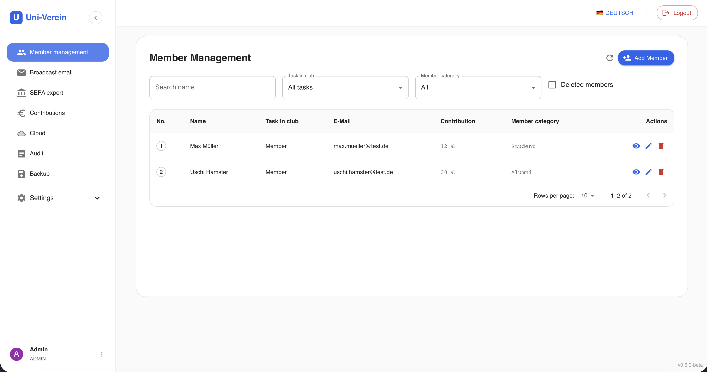

<div align="center">

# Uni-verein

### Open Source club management software for university associations

[](LICENSE)
[](https://github.com/uni-verein/uni-verein/releases/latest)
[](https://github.com/uni-verein/uni-verein/actions/workflows/ci.yml)
[](https://github.com/uni-verein/uni-verein/issues)
[](https://github.com/uni-verein/uni-verein/stargazers)

[**Live Demo**](https://demo.uni-verein.de) &nbsp;·&nbsp; [**Documentation**](https://uni-verein.de/docs/intro) &nbsp;·&nbsp; [**Report a Bug**](https://github.com/uni-verein/uni-verein/issues/new) &nbsp;·&nbsp; [**Request a Feature**](https://github.com/uni-verein/uni-verein/issues/new)

</div>

---

## 📑 Table of Contents

- [About](#-about)
- [Features](#-features)
- [Screenshots](#-screenshots)
- [Demo](#-demo)
- [Getting Started](#-getting-started)
- [Usage](#️-usage)
- [Contributing](#-contributing)
- [Roadmap](#️-roadmap)
- [License](#-license)
- [Contact](#-contact)

---

## 📖 About

**Uni-verein** is a free and open source club management software specifically designed for university associations and student clubs. Whether you run a sports club, a cultural association, or any other student organization — uni-verein helps you manage your members, mails and finances all in one place.

---

## ✨ Features

- 👥 **Member Management** — Add, edit, and organize members
- 💰 **Finance Tracking** — Keep track of membership fees, income, and expenses
- 📄 **Document Storage** — Store and share important club documents and files
- 📧 **Email Notifications** — Send mails for events or announcements
- 🔐 **Role-Based Access Control** — Assign different roles (Admin, User, Finance)
- 🌍 **Multi-language Support** — Available in multiple languages (currently DE, EN)

---

## 📸 Screenshots

<div align="center">



</div>

## 🌐 Demo

- [Live Uni-Verein Demo](https://demo.uni-verein.de)

---

## 🚀 Getting Started

### Prerequisites

Make sure you have the following installed:

- [Docker & docker compose](https://docs.docker.com/compose/install/)

### Installation

1. **Download config & installation files**

```bash
curl -O https://raw.githubusercontent.com/uni-verein/uni-verein/refs/tags/1.4.0/nginx.conf
curl -O https://raw.githubusercontent.com/uni-verein/uni-verein/refs/tags/1.4.0/docker-compose-ini.yml
curl -O https://raw.githubusercontent.com/uni-verein/uni-verein/refs/tags/1.4.0/docker-compose-prod-image.yml
```

2. **Create .env and secrets**

```bash
touch .env && mkdir backup && docker compose -f docker-compose-ini.yml up
```

Edit the `.env` file and change database secrets:

```env
DB_ROOT_PASSWORD=rootUserPassword
DB_NAME=uni-verein
DB_USER=databaseUserName
DB_PASSWORD=databaseUserPassword
```

3. **Start application**

```bash
docker compose -f docker-compose-prod-image.yml up -d
```

The application will be available at `http://localhost:80` 🎉

---

### Updating

As an admin, you'll see a notification bell in the app once a new version is available. Before updating, create a manual backup (database backup and member export, both available under Settings → Backup in the app). Then run this from your installation directory (the one containing `.env`):

```bash
curl -O https://raw.githubusercontent.com/uni-verein/uni-verein/main/docker-compose-update.yml
docker compose -f docker-compose-update.yml run --rm update
```

It checks GitHub for the latest release and asks you to confirm that you've created a manual backup — the update only proceeds once you type `yes`. It then downloads the matching `nginx.conf` and `docker-compose-prod-image.yml`, updates `VERSION` in your `.env`, and restarts the stack on the new version. Your existing secrets and database are left untouched.

> **⚠️ Breaking change between `v1.3.1` and `v1.4.0`:** `v1.4.0` replaces MariaDB with PostgreSQL. Always update using the `docker-compose-update.yml` command above, never edit `VERSION` in `.env` by hand or swap in a newer `docker-compose-prod-image.yml` yourself, as that skips the database migration below and will break your installation.

Installations still running MariaDB are updated to `v1.3.1` first (no database engine change yet) if they aren't already there. From `v1.3.1`, the next update automatically migrates the database (structure and data) to PostgreSQL and switches the whole stack `including backups` over to it. This adds some extra downtime proportional to your database size, and the old MariaDB data volume is kept (stopped, not deleted) afterward as a safety net, together with a `docker-compose-prod-image.yml.mariadb-backup` copy of your previous compose file that's kept only for the duration of the update and removed automatically once the stack has restarted successfully on PostgreSQL. Once you've confirmed everything works on PostgreSQL, you can reclaim the disk space with `docker volume rm <project>_db_data` (find the exact name via `docker volume ls`).

**Coming from an older version:** each run only advances one step (any version before `v1.3.1` → `v1.3.1` → `v1.4.0` → latest). So if you're updating from before `v1.3.1` all the way to the current latest release (even `v1.5.0`, `v1.6.1`, or newer) you need to run the command above repeatedly; it's safe to re-run and each run picks up exactly where the previous one left off. Check the printed "Installed version -> Target version" line each time, and keep going until it reports "Already up to date."

---

## 🛠️ Usage

After starting the application, you can login with credential:
- User account: Admin
- User password: admin123

For a detailed guide, please refer to our [Documentation](https://uni-verein.de/docs/intro).


## 🤝 Contributing

Contributions are what make the open source community such an amazing place to learn, inspire, and create. Any contributions you make are **greatly appreciated**!

1. Fork the project
2. Create your feature branch (`git checkout -b feature/AmazingFeature`)
3. Commit your changes (`git commit -m 'Add some AmazingFeature'`)
4. Push to the branch (`git push origin feature/AmazingFeature`)
5. Open a Pull Request

Please read our [CONTRIBUTING.md](CONTRIBUTING.md) for details on our code of conduct and the process for submitting pull requests.

---

## 🗺️ Roadmap

- [x] Member management
- [x] Mail management
- [x] Contribution management
- [x] Sepa exports
- [x] Mobile web app (iOS & Android)
- [ ] Receipt management
- [ ] Event planning (kalender)

---

## 📜 License

Distributed under the **[Apache-2.0 license](LICENSE)**. See [`LICENSE`](LICENSE) for more information.

---

## 📬 Contact

**Uni-verein Team**

- GitHub: [@uni-verein](https://github.com/uni-verein)
- Website: [uni-verein.de](https://uni-verein.de)
- LinkedIn: [René Herrmann](https://de.linkedin.com/in/rené-herrmann-aa2204199)

---
